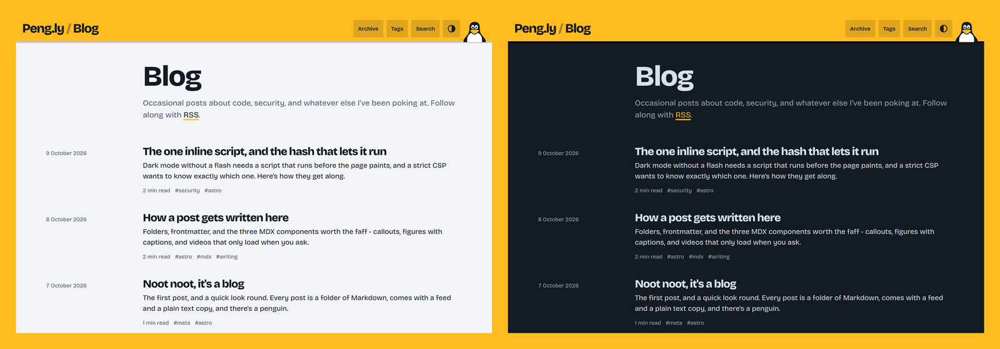

<h1 align="center">Peng.ly Blog</h1>
<p align="center">
<i>Occasional posts about code, security, and whatever else I've been poking at</i>
<br />
<b>🌐 <a href="https://blog.peng.ly/">blog.peng.ly</a></b><br />
</p>

<p align="center">
  
</p>

## About

The writing bit of [peng.ly](https://peng.ly). It's a static [Astro](https://astro.build) site with no JavaScript unless a page needs it, and every post also comes as full-text RSS, plain Markdown and an [llms.txt](https://blog.peng.ly/llms.txt) entry.

---

## Writing a post

Make a folder in `posts/` named after the address you want, then put an `index.md` in it (or `index.mdx`, for components). Pictures go in the same folder.

```yaml
---
title: Noot noot, it's a blog
description: Between 50 and 160 characters, it's what shows up in search results
date: 2026-10-07
tags: [meta, astro]
---
```

`updated`, `draft` and `cover` are optional, and [this post](https://blog.peng.ly/how-a-post-gets-written-here/) shows off the rest - callouts, figures, videos and code. The build checks every post, so a missing field or a typo in one stops it with a message saying what's wrong.

---

## Development

You'll need [Node](https://nodejs.org/) 22 or newer.

```bash
git clone git@github.com:NotAFlightRisk/blog.git
cd blog
npm install
npm run dev
```

That's on [localhost:4321](http://localhost:4321), drafts included. `npm run build` puts the finished site in `dist/`, and `npm run check` and `npm test` are what CI runs.

---

## Deployment

### Option 1: Vercel

Fork it and import it into Vercel, or use the button 👇

[](https://vercel.com/new/clone?repository-url=https%3A%2F%2Fgithub.com%2FNotAFlightRisk%2Fblog&demo-title=Peng.ly%20Blog&demo-url=https%3A%2F%2Fblog.peng.ly)

### Option 2: Any static host

Grab `site.zip` from the [latest release](https://github.com/NotAFlightRisk/blog/releases/latest), or build it yourself, and upload what's inside. The security headers live in `vercel.json`, so copy them over to your host if you want them too.

---

## Credits

##### Contributors

[](https://github.com/NotAFlightRisk/blog/graphs/contributors)

---

<!-- License + Copyright -->
<p  align="center">
  <a href="https://github.com/NotAFlightRisk"></a><br>
  <sup>
    <i>Licensed under <a href="../LICENSE">MIT</a>, © <a href="https://peng.ly">NotAFlightRisk</a> 2026</i>
  </sup>
</p>

<!--
oooh, hello there! hope you're having a nice day :)
   |\__      |\___
 (:> __)X  (:o ___(
   |/        |/
-->
